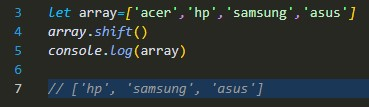

# Array

An array is an object that holds values (of any type) not particularly in named 
properties/keys, but rather in numerically indexed positions.

(tajik language)
Массив объектест, ки арзишҳоро (ҳар намуд) нигоҳ медорад, ки махсусан бо номҳо
хосиятҳо/калидҳо, балки дар мавқеъҳои рақамӣ индексатсияшуда.

### Example:

# Array Methods

push()
shift()
unshift()
reverse()
concat()
slice()
filter()
find()
forEach()
map()
reduce()
every()
toString()
join()
pop()
splice()
sort()

### push()

### unshift()

### pop()

### shift()

###  concat()

###  indexOf()

### includes()

### slice()

### splice()

### join()

### reverse()

### find()

